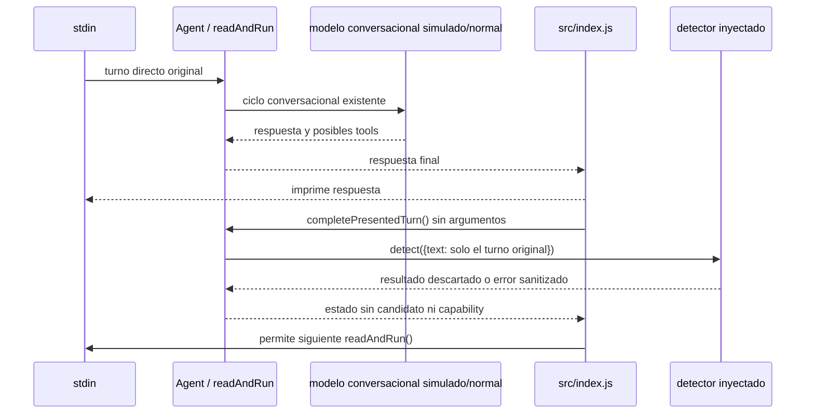

# Automatic Memory C.2 — Evaluación conversacional experimental

## Alcance y estado

C.2 conecta una interfaz de evaluación posterior a la respuesta dentro del agente, pero permanece **apagada por defecto**. La instancia actual de Nexa (`src/index.js`) no configura ni inyecta detector: el flag no está en `config`, no viene de `.env` y no existe un fallback a `createAutomaticMemoryDetector()` o a OpenAI. Esta etapa no incorpora planner, coordinador, writer, repository ni persistencia automática al agente.

En pruebas se inyecta un detector sintético. El contrato de la interfaz es `detect({ text })`; el resultado se descarta y no se devuelve al modelo, a las tools ni al usuario. La interfaz solo prueba el orden y los límites del hook; no mide calidad de extracción ni llama al modelo real.

## Implementación

`createAgent()` acepta `enableAutomaticMemoryAssessment` (default `false`) y `automaticMemoryDetector` (default `null`). Habilitar el flag sin inyectar un objeto con `detect()` falla al crear el agente; no se selecciona un extractor implícito. La aplicación CLI no pasa ninguna de estas opciones, por lo que C.2 está desactivada en Nexa normal. Un host que cambie el código y habilite explícitamente la opción aún tendría que proporcionar una dependencia; cualquier futura inyección del detector real debe pasar su propia revisión y consentimiento de privacidad.

Solo `readAndRun()` puede programar evaluación: toma el texto del objeto entregado por `readDirectUserTurn()` y lo conserva temporalmente en estado privado después de que el ciclo normal del modelo termine. No guarda el objeto de turno ni sus capabilities. Los comandos explícitos, mensajes vacíos, turnos que terminan en `salir` y errores del modelo no programan evaluación. `agent.run(text)` no lo hace.

El CLI imprime primero la respuesta. Después invoca `completePresentedTurn()` sin argumentos y espera su finalización antes de iterar hacia otra lectura de stdin. El método consume el único pendiente antes de llamar al detector, así que una segunda llamada no repite el análisis. Si el host lee otro turno sin completar la fase previa, el pendiente se descarta en vez de competir por stdin o ejecutarse antes de presentar la respuesta. El detector no lee stdin.

La evaluación recibe solo `{ text: mensajeOriginal }`. No recibe historial, salida del assistant, `function_call`, arguments/resultados de tools, contexto recuperado, command proof, runtime capability, autorización, objeto de agente ni repositorio. El agente no importa Automatic Memory, autorización automática, `json-repository` ni `commitAutomaticOperation`. La función inyectada no puede cambiar la respuesta ya producida: cualquier excepción se convierte en `automatic_memory_assessment_failed`, sin propagar detalles, texto o contenido privado al log o al resultado.

## Flujo



Este flujo no llama al detector real en C.2 normal y no crea una autorización, propuesta persistida ni escritura.

## Configuración experimental

La activación requiere ambas condiciones explícitas en composición de código:

```js
createAgent({
  enableAutomaticMemoryAssessment: true,
  automaticMemoryDetector: syntheticOrSeparatelyApprovedDetector,
});
```

No existe una variable de entorno para activar C.2. No se debe pasar el detector real de `src/memory/automatic/detector.js` hasta una fase aprobada de privacidad y extractor. La configuración de producción actual llama a `createAgent()` sin estos argumentos, de modo que no se realiza ningún análisis adicional ni llamada de red.

## Pruebas y garantías observadas

`test/memory-automatic-agent-assessment.test.js` ejecuta procesos hijos con entrada sintética real por stdin, `ask` simulado y detector inyectado:

- la opción está desactivada por defecto incluso si hay un detector simulado disponible;
- el mensaje directo original se analiza una vez tras la respuesta visible;
- tools y texto de `agent.run()` no entran al detector;
- llamar dos veces a `completePresentedTurn()` no duplica el análisis;
- una segunda lectura de stdin ocurre después de finalizar o descartar el pendiente, sin un segundo lector de confirmación;
- un error del detector no cambia respuestas, no escribe y no expone detalles de error;
- un error del agente deja el turno sin evaluación y no impide evaluar el siguiente turno completo;
- las respuestas del modelo marcadas `incomplete` no programan evaluación, aunque el comportamiento conversacional existente siga mostrando su texto parcial;
- si el detector queda pendiente, la respuesta ya se entregó, pero la cola del agente mantiene en espera los turnos siguientes;
- cerrar el agente durante una evaluación en curso no cancela la promesa del detector;
- no se permite habilitar la opción sin dependencia inyectada;
- la CLI presenta la respuesta antes de llamar al hook;
- no se importan coordinator ni writer desde el agente.

Las pruebas no llaman a OpenAI: `ask` y detector son stubs. No se inspecciona ni persiste una conversación personal, no se crea ningún store v2 y no se escribe Memory1. El hook descarta deliberadamente el resultado, incluidos candidatos; por lo tanto no prueba una interfaz de usuario para propuesta/confirmación ni una integración de policy/planner.

La elegibilidad de evaluación requiere que cada respuesta de Responses API observada durante el ciclo tenga `status: "completed"` y que se haya producido una respuesta textual no vacía. Si una respuesta no tiene estado, queda incompleta o falla el modelo, el agente conserva su comportamiento conversacional existente y omite la evaluación.

## Límites y privacidad

- En la configuración actual el número de llamadas extra a OpenAI por C.2 es cero. El mecanismo de A, si se inyectara explícitamente en una etapa futura, realiza un envío adicional del texto al modelo configurado. No queda autorizado por este cambio.
- El screening de credenciales de A es heurístico y la sensibilidad semántica se determina después de la extracción. No garantiza que todo secreto o dato sensible se mantenga local. La detección real necesita decisión explícita sobre aviso, consentimiento, categorías prohibidas, retención y coste.
- El hook es de evaluación únicamente. `auto_save` no equivale a autorización. ASK, IGNORE, DUPLICATE, ADD y REPLACE no se muestran ni escriben en esta fase; no hay confirmación ni capability nueva.
- No se crea autoridad de turno nueva: la elegibilidad nace solo del camino `readDirectUserTurn()` → estado privado de `readAndRun()`. El hash/turno no se acepta como claim de `agent.run()` ni de tools.
- El modelo puede usar tools en el ciclo conversacional normal, como antes; C.2 no envía el candidato ni el resultado del detector a tools. Este alcance no cambia las otras políticas de datos del agente.
- El flag está disponible para hosts que construyen `createAgent()` y el objeto `detect` es una dependencia de código. No es una frontera contra ejecución arbitraria de módulos dentro del mismo proceso. La aplicación CLI no habilita ese camino.
- El agente espera la finalización del detector antes de aceptar el siguiente turno. Un detector lento aumenta la pausa entre turnos; uno que nunca termina deja la cola esperando indefinidamente. Cerrar el agente limpia un pendiente aún no iniciado, pero no cancela un detector que ya comenzó. C.2 no ofrece timeout ni cancelación: un timeout superficial dejaría la operación subyacente activa y podría permitir trabajo tras el cierre. Antes de cualquier extractor real se necesita un contrato cancelable/cooperativo y una política de timeout/cierre revisados.

## Condiciones antes de habilitar el extractor real

1. Resolver privacidad y consentimiento para el envío adicional; definir qué mensajes/categorías no se transmiten.
2. Diseñar y probar timeout/cancelación cooperativos y cierre seguro; no se implementan en C.2.
3. Aprobar una composición explícita y controlada del detector real; jamás usar `auto_save` como permiso.
4. Mantener clasificación, planner y coordinator separados; en una etapa posterior exigir confirmación independiente para cada ADD y REPLACE.
5. Mantener la serialización de stdin y retención efímera de texto estrictamente acotada; verificar EOF, error, cierre y turnos concurrentes.
6. Probar integración completa con extractor simulado, sin repositorio personal, y repetir revisión de seguridad antes de cualquier persistencia experimental.
7. Memory1 sigue siendo backend efectivo; cualquier uso de Memory2 requiere fixture temporal en etapa separada. Activación o migración personal exige autorización posterior explícita.

## Resultado

C.2 deja un hook post-respuesta para evaluación inyectable, desactivado en la CLI normal. Un detector no terminado sí retiene la cola y puede retrasar el siguiente turno; el extractor real continúa deshabilitado. La respuesta conversacional ya producida no se altera, no se crea autoridad nueva y no se trasladan capabilities al modelo/tools. No inicia C.3 ni habilita aprendizaje real.

## Validación de cierre

- C.2: 8/8 pruebas.
- Automatic Memory: 80/80 pruebas.
- Memory: 301/301 pruebas.
- Suite completa: 494/494 pruebas en la ejecución permitida para Chromium. La ejecución dentro del sandbox produjo 493/494 por `spawn EPERM` al iniciar Chromium en la prueba de voz; la repetición sin ese bloqueo pasó.
- `git diff --check`: limpio.
- No se hicieron llamadas reales a OpenAI ni escrituras de memoria. Memory1 permaneció intacta; Memory2 continuó desactivada y no se creó un store personal.
